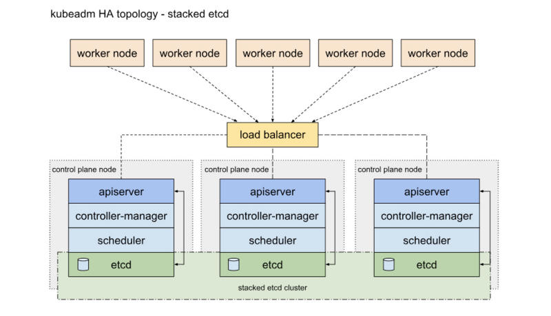
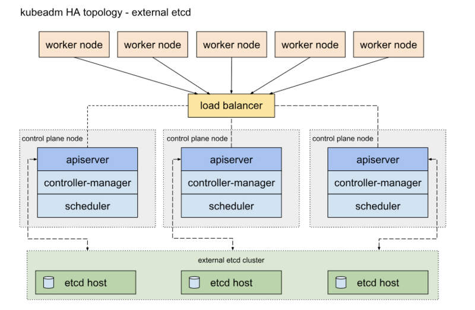
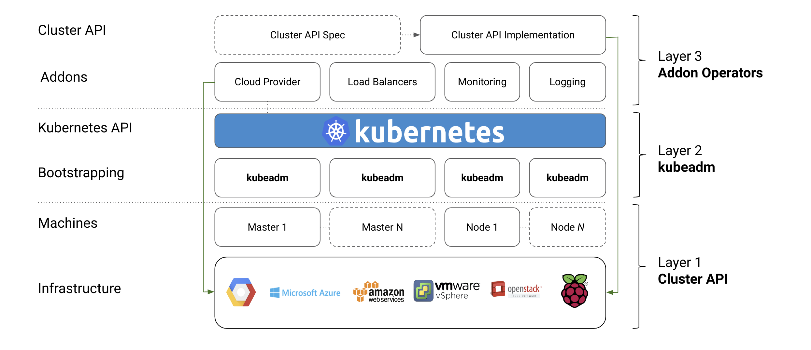

# kubernetes实践-kubeadm部署k8s高可用集群

 [TOC]

HA(High Avalilability)的部署有两种方式

 * 一种是将etcd 和master节点名组件混布在一起

   

 * 另一种是，使用独立的Etcd集群，不与Master节点混布

   

   两者主要配置区别在于kubeadm中设置

#### 1、机器准备

  * **机器准备**

    | ip            | hostname       |
    | ------------- | -------------- |
    | 172.16.15.199 | k8s-master     |
    | 172.16.15.201 | k8s-node1      |
    | 172.16.15.202 | k8s-node2      |
    | 172.16.15.88  | Keppalived VIP |

* **修改主机名**

  ```sh
  [root@master1 ~]# hostnamectl set-hostname 主机名
  ```

* **配置各节点hosts文件**

  ```sh
  [root@k8s-master ~]# cat /etc/hosts
  127.0.0.1   localhost localhost.localdomain localhost4 localhost4.localdomain4
  ::1         localhost localhost.localdomain localhost6 localhost6.localdomain6
  
  172.16.15.199 k8s-master
  172.16.15.201 k8s-node1
  172.16.15.202 k8s-node2
  ```

  

* **关闭防火墙(所有机器)**

  ```sh
  [root@master1 ~]# systemctl stop firewalld && systemctl disable firewalld
  ```

* **关闭所有节点selinux(所有机器)**

  > selinux 主要作用就是最大限度地减小系统中服务进程可访问的资源（最小权限原则）

  ```sh
  [root@k8s-master ~]# cat /etc/selinux/config 
  SELINUX=disabled        # 改成disabled
  SELINUXTYPE=targeted
  ```

* **关闭swap(所有机器)**

  ```sh
  sed -i 's/.*swap.*/#&/' /etc/fstab
  ```

* **重启服务器(所有机器)**

  ```sh
  reboot
  ```

  

* **配置机器免密登陆(所有机器)**

  ```sh
  ssh-keygen -t rsa	#将/root/.ssh/id_rsa.pub scp至 需要登陆本机的/root/.ssh/authorized_keys
  ```

  

* **安装同步时钟(所有机器)**

  ```sh
  [root@k8s-master ~]# yum install -y ntpdate
  [root@k8s-master ~]# ntpdate time.windows.com
  ```

* **各节点内核调整,将桥接的IPv4流量传递到iptables的链(所有机器)**

  ```sh
  [root@k8s-master ~]# 
  cat > /etc/sysctl.d/k8s.conf << EOF
  net.bridge.bridge-nf-call-ip6tables = 1
  net.bridge.bridge-nf-call-iptables = 1
  net.ipv4.ip_nonlocal_bind = 1
  net.ipv4.ip_forward = 1
  EOF
  
  sysctl -p /etc/sysctl.d/k8s.conf
  ```

* **各节点安装ipset服务(所有机器)**

  ```sh
  [root@k8s-master ~]# yum -y install ipvsadm ipset sysstat conntrack libseccomp
  ```

* **各节点开启ipvs模块(所有机器)**

  ```sh
  [root@k8s-master ~]# 
  cat > /etc/sysconfig/modules/ipvs.modules <<EOF
       #!/bin/sh
       modprobe -- ip_vs
       modprobe -- ip_vs_rr
       modprobe -- ip_vs_wrr
       modprobe -- ip_vs_sh
       modprobe -- nf_conntrack_ipv4
       EOF
  
  chmod 755 /etc/sysconfig/modules/ipvs.modules && bash /etc/sysconfig/modules/ipvs.modules && lsmod | grep -e ip_vs -e nf_conntrack_ipv4
  ```
#### 2、keepalived && haproxy

> Keepalived起初是为LVS设计的，专门用来监控集群系统中各个服务节点的状态，它根据TCP/IP参考模型的第三、第四层、第五层交换机制检测每个服务节点的状态，如果某个服务器节点出现异常，或者工作出现故障，Keepalived将检测到，并将出现的故障的服务器节点从集群系统中剔除，这些工作全部是自动完成的，不需要人工干涉，需要人工完成的只是修复出现故障的服务节点。

>
>后来Keepalived又加入了VRRP的功能，VRRP（Vritrual Router Redundancy Protocol,虚拟路由冗余协议)出现的目的是解决静态路由出现的单点故障问题，通过VRRP可以实现网络不间断稳定运行，因此Keepalvied 一方面具有服务器状态检测和故障隔离功能，另外一方面也有HA cluster功能，下面介绍一下VRRP协议实现的过程。

>HAProxy提供**高可用性**、**负载均衡**以及基于TCP和HTTP应用的代理，**支持虚拟主机**，它是免费、快速并且可靠的一种解决方案。HAProxy特别适用于那些负载特大的web站点， 这些站点通常又需要会话保持或七层处理。HAProxy运行在当前的硬件上，完全可以支持数以万计的并发连接。并且它的运行模式使得它可以很简单安全的整合进您当前的架构中， 同时可以保护你的web服务器不被暴露到网络上。

* **安装**

  ```sh
  yum -y install haproxy keepalived
  ```

* **修改k8s-master keepalived配置文件**

  ```perl
  [root@k8s-master ~]#  cat /etc/keepalived/keepalived.conf 
  ! Configuration File for keepalived
  
  global_defs {
     router_id LVS_DEVEL
  
  # 添加如下内容
     script_user root
     enable_script_security
  }
  
  
  
  vrrp_script check_haproxy {
      script "/etc/keepalived/check_haproxy.sh"         # 检测脚本路径
      interval 3
      weight -2 
      fall 10
      rise 2
  }
  
  
  
  vrrp_instance VI_1 {
      state MASTER            # MASTER
      interface ens18         # 本机网卡名
      virtual_router_id 51
      priority 100             # 权重100
      advert_int 1
      authentication {
          auth_type PASS
          auth_pass 1111
      }
      virtual_ipaddress {
          172.16.15.88      # 虚拟IP
      }
      track_script {
          check_haproxy       # 模块
      }
  }
  ```

* **修改k8s-node1 keepalived配置文件**

  ```shell
  [root@k8s-master ~]# cat /etc/keepalived/keepalived.conf 
  ! Configuration File for keepalived
  
  global_defs {
     router_id LVS_DEVEL
  
  # 添加如下内容
     script_user root
     enable_script_security
  }
  
  
  
  vrrp_script check_haproxy {
      script "/etc/keepalived/check_haproxy.sh"         # 检测脚本路径
      interval 3
      weight -2 
      fall 10
      rise 2
  }
  
  
  
  vrrp_instance VI_1 {
      state BACKUP            # MASTER
      interface ens18         # 本机网卡名
      virtual_router_id 51
      priority 99             # 权重99
      advert_int 1
      authentication {
          auth_type PASS
          auth_pass 1111
      }
      virtual_ipaddress {
          172.16.15.88      # 虚拟IP
      }
      track_script {
          check_haproxy       # 模块
      }
  }
  ```

* **修改k8s-node2 keepalived配置文件**

  ```sh
  [root@k8s-master ~]# cat /etc/keepalived/keepalived.conf 
  ! Configuration File for keepalived
  
  global_defs {
     router_id LVS_DEVEL
  
  # 添加如下内容
     script_user root
     enable_script_security
  }
  
  
  
  vrrp_script check_haproxy {
      script "/etc/keepalived/check_haproxy.sh"         # 检测脚本路径
      interval 3
      weight -2 
      fall 10
      rise 2
  }
  
  
  
  vrrp_instance VI_1 {
      state BACKUP            # MASTER
      interface ens18         # 本机网卡名
      virtual_router_id 51
      priority 98             # 权重98
      advert_int 1
      authentication {
          auth_type PASS
          auth_pass 1111
      }
      virtual_ipaddress {
          172.16.15.88      # 虚拟IP
      }
      track_script {
          check_haproxy       # 模块
      }
  }
  ```

* **三台master节点haproxy配置都一样**

  ```sh
  [root@k8s-master ~]# cat /etc/haproxy/haproxy.cfg 
  --------------------------
  #---------------------------------------------------------------------
  # Example configuration for a possible web application.  See the
  # full configuration options online.
  #
  #   http://haproxy.1wt.eu/download/1.4/doc/configuration.txt
  #
  #---------------------------------------------------------------------
  
  #---------------------------------------------------------------------
  # Global settings
  #---------------------------------------------------------------------
  global
      # to have these messages end up in /var/log/haproxy.log you will
      # need to:
      #
      # 1) configure syslog to accept network log events.  This is done
      #    by adding the '-r' option to the SYSLOGD_OPTIONS in
      #    /etc/sysconfig/syslog
      #
      # 2) configure local2 events to go to the /var/log/haproxy.log
      #   file. A line like the following can be added to
      #   /etc/sysconfig/syslog
      #
      #    local2.*                       /var/log/haproxy.log
      #
      log         127.0.0.1 local2
  
      chroot      /var/lib/haproxy
      pidfile     /var/run/haproxy.pid
      maxconn     4000
      user        haproxy
      group       haproxy
      daemon
  
      # turn on stats unix socket
      stats socket /var/lib/haproxy/stats
  
  #---------------------------------------------------------------------
  # common defaults that all the 'listen' and 'backend' sections will
  # use if not designated in their block
  #---------------------------------------------------------------------
  defaults
      mode                    http
      log                     global
      option                  httplog
      option                  dontlognull
      option http-server-close
      option forwardfor       except 127.0.0.0/8
      option                  redispatch
      retries                 3
      timeout http-request    10s
      timeout queue           1m
      timeout connect         10s
      timeout client          1m
      timeout server          1m
      timeout http-keep-alive 10s
      timeout check           10s
      maxconn                 3000
  
  #---------------------------------------------------------------------
  # main frontend which proxys to the backends
  #---------------------------------------------------------------------
  frontend  kubernetes-apiserver
      mode                        tcp
      bind                        *:16443
      option                      tcplog
      default_backend             kubernetes-apiserver
  
  #---------------------------------------------------------------------
  # static backend for serving up images, stylesheets and such
  #---------------------------------------------------------------------
  listen stats
      bind            *:1080
      stats auth      admin:awesomePassword
      stats refresh   5s
      stats realm     HAProxy\ Statistics
      stats uri       /admin?stats
  
  #---------------------------------------------------------------------
  # round robin balancing between the various backends
  #---------------------------------------------------------------------
  backend kubernetes-apiserver
      mode        tcp
      balance     roundrobin
      server  master1 172.16.15.199:6443 check
      server  master2 172.16.15.201:6443 check
      server  master3 172.16.15.202:6443 check
  ```

* **每台master节点编写健康监测脚本**

  ```sh
  [root@k8s-master ~]# cat /etc/keepalived/check_haproxy.sh 
  -------
  # !/bin/sh
  # HAPROXY down
  A=`ps -C haproxy --no-header | wc -l`
  if [ $A -eq 0 ]
  then
  systmectl start haproxy
  if [ ps -C haproxy --no-header | wc -l -eq 0 ]
  then
  killall -9 haproxy
  echo "HAPROXY down" | mail -s "haproxy"
  sleep 3600
  fi 
  
  fi
  
  --------------
  #  给脚本加上执行权限
  [root@k8s-master ~]# cd  /etc/keepalived/ chmod +x check_haproxy.sh
  ```

* **启动keepalived和haproxy**

  ```sh
  [root@k8s-master ~]# systemctl start keepalived && systemctl enable keepalived
  [root@k8s-master ~]# systemctl start haproxy && systemctl enable haproxy
  
  # 查看ip 地址
  [root@k8s-master ~]# ip a
  1: lo: <LOOPBACK,UP,LOWER_UP> mtu 65536 qdisc noqueue state UNKNOWN group default qlen 1000
      link/loopback 00:00:00:00:00:00 brd 00:00:00:00:00:00
      inet 127.0.0.1/8 scope host lo
         valid_lft forever preferred_lft forever
      inet6 ::1/128 scope host 
         valid_lft forever preferred_lft forever
  2: ens18: <BROADCAST,MULTICAST,UP,LOWER_UP> mtu 1500 qdisc fq_codel state UP group default qlen 1000
      link/ether 3e:25:7f:9d:25:4c brd ff:ff:ff:ff:ff:ff
      inet 172.16.15.199/20 brd 172.16.15.255 scope global ens18
         valid_lft forever preferred_lft forever
      inet 172.16.15.88/32 scope global ens18
         valid_lft forever preferred_lft forever
      inet6 fe80::3c25:7fff:fe9d:254c/64 scope link 
         valid_lft forever preferred_lft forever
  
  ----------------------
  #  可以看出虚拟ip 172.16.15.88 已经被添加到网卡中   当k8s-master出现故障时候，虚拟ip 会根据 keepalived配置文件中priority 自动漂移到 k8s-node1中
  ```

  

#### 3、安装kubernetes

* **增加k8s 源**

  ```sh
  [root@k8s-master ~]# cat /etc/yum.repos.d/kubernetes.repo
  ----------------------------------------
  [kubernetes]
  name=kubernetes_repo
  baseurl=https://mirrors.aliyun.com/kubernetes/yum/repos/kubernetes-el7-x86_64/
  gpgcheck=0
  gpgkey=https://mirrors.aliyun.com/kubernetes/yum/doc/yum-key.gpg
  enabled=1
  ```

* **安装docker kubelet kubeadm kubelectl(所有节点)**

  ```sh
  [root@k8s-master ~]# yum install -y docker-ce kubelet kubeadm kubectl 
  ```

* **各节点配置docker加速器并修改成k8s驱动 daemon.json文件如果没有自己创建**

  ```sh
  [root@k8s-master ~]# cat /etc/docker/daemon.json
  {
    "exec-opts": ["native.cgroupdriver=systemd"],
    "log-driver": "json-file",
    "log-opts": {
      "max-size": "100m"
    },
    "storage-driver": "overlay2",
    "storage-opts": [
      "overlay2.override_kernel_check=true"
    ]
  }
  ```

* **开启docker**

  ```sh
  [root@k8s-master ~]# systemctl enable docker && systemctl start  docker
  ```

* **开启kubernetes**

  ```sh
  [root@k8s-master ~]# systemctl enable kubelet && systemctl start  kubelet
  ```

#### 4、使用kubeadm部署kubernetes

* **kubeadm和其他组件关系**



* **生成默认kubeadm配置文件**

  ```sh
  [root@k8s-master ~]# kubeadm config print init-defaults > kubeadm-config.yaml
  ```

* **修改初始化配置文件**

  ```yaml
  apiVersion: kubeadm.k8s.io/v1beta2
  bootstrapTokens:
  - groups:
    - system:bootstrappers:kubeadm:default-node-token
    token: abcdef.0123456789abcdef
    ttl: 24h0m0s
    usages:
    - signing
    - authentication
  kind: InitConfiguration
  localAPIEndpoint:
    advertiseAddress: 172.16.15.199	# 本机IP
    bindPort: 6443
  nodeRegistration:
    criSocket: /var/run/dockershim.sock
    name: k8s-master					# 本主机名
    taints:
    - effect: NoSchedule
      key: node-role.kubernetes.io/master
  ---
  apiServer:
    timeoutForControlPlane: 4m0s
  apiVersion: kubeadm.k8s.io/v1beta2
  certificatesDir: /etc/kubernetes/pki
  clusterName: kubernetes
  controlPlaneEndpoint: 172.16.15.88:16443		# 虚拟IP和haproxy端口
  controllerManager: {}
  dns:
    type: CoreDNS
  etcd:
    local:
      dataDir: /var/lib/etcd
  imageRepository: registry.aliyuncs.com/google_containers		# 阿里镜像仓库
  kind: ClusterConfiguration
  kubernetesVersion: v1.20.0
  networking:
    dnsDomain: cluster.local
    podSubnet: 10.244.0.0/16						# pod ip段
    serviceSubnet: 10.233.0.0/16					# svc ip段
  scheduler: {}
  ---
  apiVersion: kubeproxy.config.k8s.io/v1alpha1
  kind: KubeProxyConfiguration
  mode: ipvs
  ```

* **外挂etcd集群设置**

  ```yaml
  #  kubeadm-config.yaml 中 etcd 段相应修改为
  etcd:
      external:
          endpoints:
          - https://172.16.15.100:2379		# 外挂的 etcd集群节点
          - https://172.16.15.101:2379		# 外挂的 etcd集群节点
          - https://172.16.15.102:2379		# 外挂的 etcd集群节点
          caFile: /usr/local/kubernetes/ssl/ca.pem
          certFile: /usr/local/kubernetes/ssl/etcd.pem
          keyFile: /usr/local/kubernetes/ssl/etcd-key.pem
  ```

  

* **下载相关镜像**

  ```sh
  [root@k8s-master ~]# kubeadm config images pull --config kubeadm-config.yaml
  ```

* **初始化集群**

  ```sh
  [root@k8s-master ~]# kubeadm init --config kubeadm-config.yaml
  -----------
  ...
  ...
  ...
  You can now join any number of control-plane nodes by copying certificate authorities
  and service account keys on each node and then running the following as root:
  
    kubeadm join 172.16.15.88:16443 --token lztkc9.kc6emyyr3dnocfdq     
    	--discovery-token-ca-cert-hash sha256:386e5dda3349ee6665cc9f30df60f216f7b9f9780614c3461a08d61c652a2a8e 
      --control-plane 
  
  Then you can join any number of worker nodes by running the following on each as root:
  
    kubeadm join 172.16.15.88:16443 --token lztkc9.kc6emyyr3dnocfdq     
    	--discovery-token-ca-cert-hash sha256:386e5dda3349ee6665cc9f30df60f216f7b9f9780614c3461a08d61c652a2a8e 
  ```

* 登陆从master 复制主master文件到各自机器上

  ```sh
  [root@k8s-node1 ~]# mkdir -p /etc/kubernetes/pki/etcd
  ----
  [root@k8s-node1 ~]# scp root@172.16.15.199:/etc/kubernetes/pki/ca.* /etc/kubernetes/pki/
  [root@k8s-node1 ~]# scp root@172.16.15.199:/etc/kubernetes/pki/sa.* /etc/kubernetes/pki/
  [root@k8s-node1 ~]# scp root@172.16.15.199:/etc/kubernetes/pki/front-proxy-ca.* /etc/kubernetes/pki/
  [root@k8s-node1 ~]# scp root@172.16.15.199:/etc/kubernetes/pki/etcd/ca.* /etc/kubernetes/pki/etcd/
  [root@k8s-node1 ~]# scp root@172.16.15.199:/etc/kubernetes/admin.conf /etc/kubernetes/
  
  ```

* **其他master节点加入集群执行以下命令**

  ```sh
  kubeadm join 172.16.15.88:16443 --token lztkc9.kc6emyyr3dnocfdq     
  --discovery-token-ca-cert-hash sha256:386e5dda3349ee6665cc9f30df60f216f7b9f9780614c3461a08d61c652a2a8e 
  --control-plane 
  ```

* **普通node节点加入集群执行以下命令**

  ```sh
  kubeadm join 192.168.200.16:16443 --token abcdef.0123456789abcdef \
  --discovery-token-ca-cert-hash sha256:f0489748e3b77a9a29443dae2c4c0dfe6ff4bde0daf3ca8740dd9ab6a9693a78
  ```

* **所有master节点执行以下命令，node节点随意**

  ```sh
  [root@k8s-master ~]# echo "export KUBECONFIG=/etc/kubernetes/admin.conf" >> ~/.bash_profile
  [root@k8s-master ~]# source .bash_profile
  ```

* **安装网络插件**

  ```sh
  # 网上下载kube-flannel.yml
  [root@k8s-master ~]# kubectl apply -f kube-flannel.yml
  ```

* 查看node pod 状态

  ```sh
  [root@k8s-master ~]# kubectl get nodes
  NAME         STATUS   ROLES                  AGE    VERSION
  k8s-master   Ready    control-plane,master   116m   v1.20.2
  k8s-node1    Ready    control-plane,master   105m   v1.20.2
  k8s-node2    Ready    control-plane,master   105m   v1.20.2
  [root@k8s-master ~]# kubectl get po -A
  NAMESPACE     NAME                                 READY   STATUS    RESTARTS   AGE
  kube-system   coredns-7f89b7bc75-6jrqt             1/1     Running   0          116m
  kube-system   coredns-7f89b7bc75-v6hxl             1/1     Running   0          116m
  kube-system   etcd-k8s-master                      1/1     Running   0          116m
  kube-system   etcd-k8s-node1                       1/1     Running   0          104m
  kube-system   etcd-k8s-node2                       1/1     Running   0          104m
  kube-system   kube-apiserver-k8s-master            1/1     Running   0          116m
  kube-system   kube-apiserver-k8s-node1             1/1     Running   0          103m
  kube-system   kube-apiserver-k8s-node2             1/1     Running   0          104m
  kube-system   kube-controller-manager-k8s-master   1/1     Running   1          116m
  kube-system   kube-controller-manager-k8s-node1    1/1     Running   0          103m
  kube-system   kube-controller-manager-k8s-node2    1/1     Running   0          104m
  kube-system   kube-flannel-ds-amd64-p2pwk          1/1     Running   0          115m
  kube-system   kube-flannel-ds-amd64-v54lg          1/1     Running   0          104m
  kube-system   kube-flannel-ds-amd64-vl2tf          1/1     Running   0          104m
  kube-system   kube-proxy-ntn74                     1/1     Running   0          116m
  kube-system   kube-proxy-r7v8z                     1/1     Running   0          104m
  kube-system   kube-proxy-wb8bx                     1/1     Running   0          104m
  kube-system   kube-scheduler-k8s-master            1/1     Running   1          116m
  kube-system   kube-scheduler-k8s-node1             1/1     Running   0          103m
  kube-system   kube-scheduler-k8s-node2             1/1     Running   0          104m
  ---------
  # 可以看出etcd  controller apiserver等都是多副本
  ```


#### 5、检查etcd

* **安装etcdctl工具**

  ```sh
  wget https://github.com/etcd-io/etcd/releases/download/v3.4.14/etcd-v3.4.14-linux-amd64.tar.gz &&
  tar -zxf etcd-v3.4.14-linux-amd64.tar.gz &&
  mv etcd-v3.4.14-linux-amd64/etcdctl /usr/local/bin &&
  chmod +x /usr/local/bin/
  ```

* **查看etcd高可用集群健康状态**

  ```sh
  [root@k8s-master ~]#  ETCDCTL_API=3 etcdctl --cacert=/etc/kubernetes/pki/etcd/ca.crt --cert=/etc/kubernetes/pki/etcd/peer.crt --key=/etc/kubernetes/pki/etcd/peer.key --write-out=table --endpoints=172.16.15.199:2379,172.16.15.201:2379,172.16.15.202:2379,172.16.15.204:2379 endpoint health
  {"level":"warn","ts":"2021-02-07T15:24:36.683+0800","caller":"clientv3/retry_interceptor.go:62","msg":"retrying of unary invoker failed","target":"endpoint://client-f034f8a6-4aa4-4e40-bdb1-6ba3a555c87c/172.16.15.204:2379","attempt":0,"error":"rpc error: code = DeadlineExceeded desc = latest balancer error: all SubConns are in TransientFailure, latest connection error: connection error: desc = \"transport: Error while dialing dial tcp 172.16.15.204:2379: connect: no route to host\""}
  +--------------------+--------+--------------+---------------------------+
  |      ENDPOINT      | HEALTH |     TOOK     |           ERROR           |
  +--------------------+--------+--------------+---------------------------+
  | 172.16.15.201:2379 |   true |   9.133563ms |                           |
  | 172.16.15.202:2379 |   true |   9.337509ms |                           |
  | 172.16.15.199:2379 |   true |   9.353658ms |                           |
  | 172.16.15.204:2379 |  false | 5.000211913s | context deadline exceeded |
  +--------------------+--------+--------------+---------------------------+
  Error: unhealthy cluster
  -------------------
  # 特意增加 172.16.15.204 假数据对比
  ```

* **查看etcd高可用集群列表**

  ```sh
  [root@k8s-master ~]#  ETCDCTL_API=3 etcdctl --cacert=/etc/kubernetes/pki/etcd/ca.crt --cert=/etc/kubernetes/pki/etcd/peer.crt --key=/etc/kubernetes/pki/etcd/peer.key --write-out=table --endpoints=172.16.15.199:2379,172.16.15.201:2379,172.16.15.202:2379 member list
  +------------------+---------+------------+----------------------------+----------------------------+------------+
  |        ID        | STATUS  |    NAME    |         PEER ADDRS         |        CLIENT ADDRS        | IS LEARNER |
  +------------------+---------+------------+----------------------------+----------------------------+------------+
  | 2df1354dd7806612 | started | k8s-master | https://172.16.15.199:2380 | https://172.16.15.199:2379 |      false |
  | 2f4569e76ce76804 | started |  k8s-node1 | https://172.16.15.201:2380 | https://172.16.15.201:2379 |      false |
  | 81ba584fa9188a0c | started |  k8s-node2 | https://172.16.15.202:2380 | https://172.16.15.202:2379 |      false |
  +------------------+---------+------------+----------------------------+----------------------------+------------+
  
  ```

* **查看etcd高可用集群leader

  ```sh
  [root@k8s-master ~]#  ETCDCTL_API=3 etcdctl --cacert=/etc/kubernetes/pki/etcd/ca.crt --cert=/etc/kubernetes/pki/etcd/peer.crt --key=/etc/kubernetes/pki/etcd/peer.key --write-out=table --endpoints=172.16.15.199:2379,172.16.15.201:2379,172.16.15.202:2379 endpoint status
  +--------------------+------------------+---------+---------+-----------+------------+-----------+------------+--------------------+--------+
  |      ENDPOINT      |        ID        | VERSION | DB SIZE | IS LEADER | IS LEARNER | RAFT TERM | RAFT INDEX | RAFT APPLIED INDEX | ERRORS |
  +--------------------+------------------+---------+---------+-----------+------------+-----------+------------+--------------------+--------+
  | 172.16.15.199:2379 | 2df1354dd7806612 |  3.4.13 |  2.3 MB |      true |      false |         5 |      18719 |              18719 |        |
  | 172.16.15.201:2379 | 2f4569e76ce76804 |  3.4.13 |  2.3 MB |     false |      false |         5 |      18719 |              18719 |        |
  | 172.16.15.202:2379 | 81ba584fa9188a0c |  3.4.13 |  2.3 MB |     false |      false |         5 |      18719 |              18719 |        |
  +--------------------+------------------+---------+---------+-----------+------------+-----------+------------+--------------------+--------+
  
  ```

  >  可以看出 kubeadm 支持自动创建etcd集群和 外挂etcd 集群达到高可用的目的