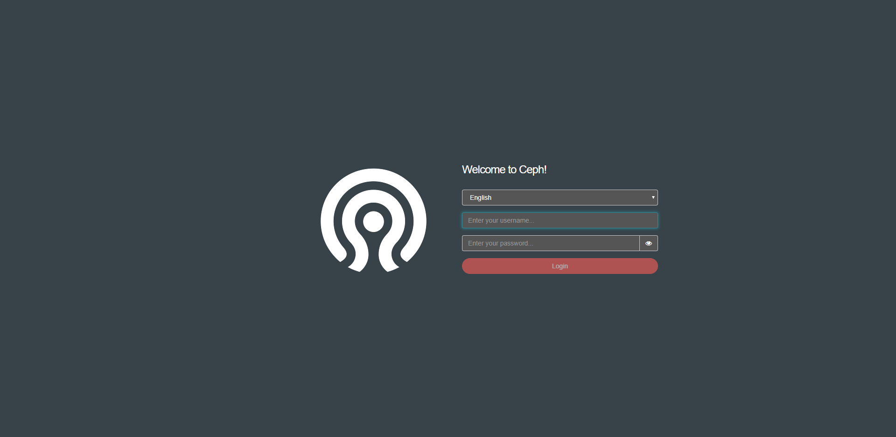
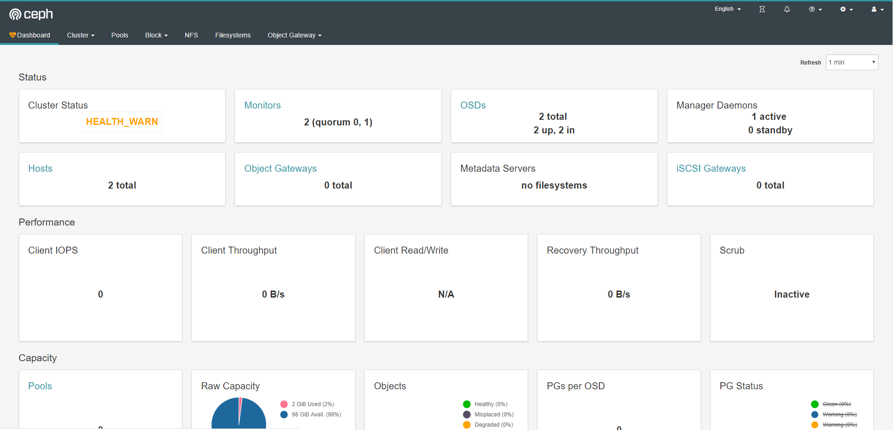
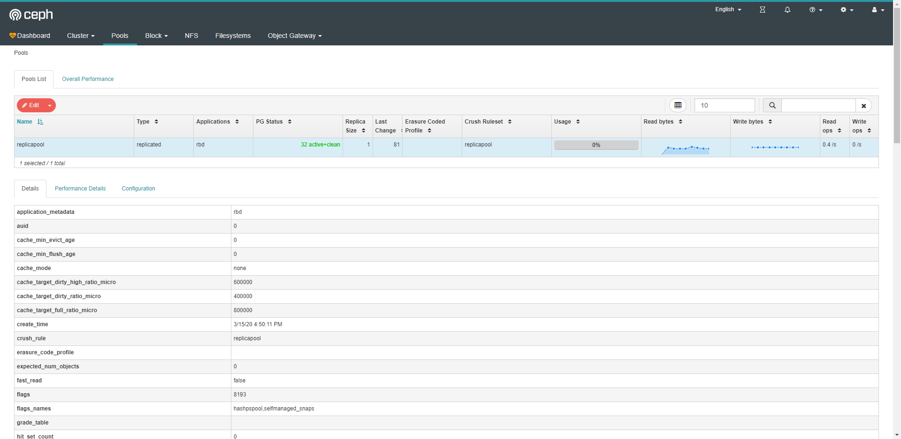
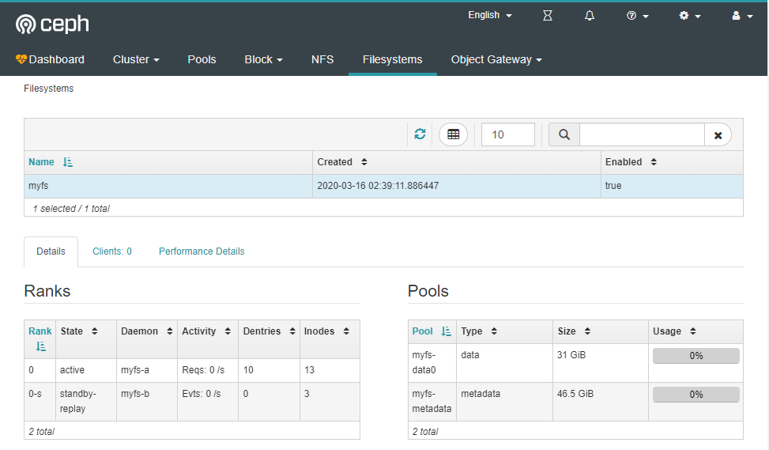
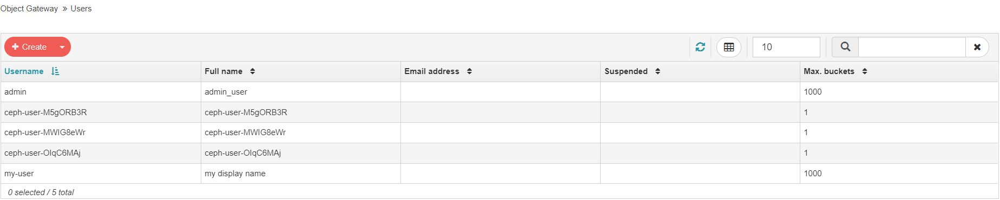
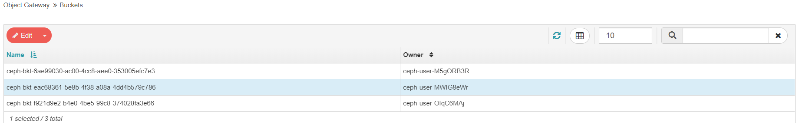

## kubernetes实践:使用rook部署ceph

[TOC]


### 1、简介

#### 1.1、Rook对Ceph的管理

​		Ceph是一个分布式存储系统，支持文件、块、对象存储，在生产环境中被广泛应用。使用rook部署ceph集群后，在rook-ceph这个namespace下会启动如下一些pod，分为以下几种类型：

* mon

* mgr

* osd
* mds
* rgw
* mon

#### 1.2、mon：

​		即Ceph集群中的mon(monitor)组件，负责监控整个Ceph集群的运行状况。会启动quorum中指定个数的mon，一般集群中会有三个mon以保证集群的高可用。在创建集群时，Rook会：

* 启动特定节点上的mon，确保与quorum中指定的相同
* 之后，定期检查mon的数量，确保与quorum中指定的相同；如果某个mon挂了，并且没有自动重启，Operator会再起一个新的mon，加到quorum中，并从quorum中移除失效的mon
* 有mon挂了后，更新Ceph客户端和Daemons中的mon的IP地址

#### 1.3、mgr

​		即Ceph集群中的mgr(manager)组件，主要负责监控一些非paxos相关的服务(比如pg相关统计信息)，这里的mgr是一个无状态服务，提供集群一些非paxos相关的监控指标。Rook除了启动mgr外，还负责配置其它两个mgr插件：

* 收集可供Prometheus抓取的指标
* 启动Ceph dashoard

#### 1.4、osd

osd即Ceph集群的osd组件，集群的核心存储组件。

#### 1.5、mds

​		即Ceph集群的mds组件，是Ceph分布式文件系统的元数据服务器。一或多个mds 协作管理文件系统的命名空间、协调到共享osd集群的访问。当在集群中声明要一个共享文件系统时，Rook会：

* 为CephFS创建metadata和数据池
* 创建文件系统
* 启动指定数量active-standby的mds实例

创建的共享文件系统可以被集群中Pod使用。

#### 1.6、rgw

即Ceph集群的rgw组件，为应用提供RESTful类型的对象存储接口。当在集群中声明要一个对象存储时，Rook会：

* 为对象存储创建metadata和数据池
* 启动rgw daemon，如果需要还可以运行多个实例做高可用
* 创建一个service来为rgw daemon提供一个负载均衡访问地址

#### 1.7、其他一些介绍

* Rook Operator：Rook 的核心组件，Rook Operator 是一个简单的容器，自动启动存储集群，并监控存储守护进程，来确保存储集群的健康。
* Rook Agent：在每个存储节点上运行，并配置一个 FlexVolume 插件，和 Kubernetes 的存储卷控制框架进行集成。Agent 处理所有的存储操作，例如挂接网络存储设备、在主机上加载存储卷以及格式化文件系统等。
* Rook Discovers：检测挂接到存储节点上的存储设备。
* Rook 还会用 Kubernetes Pod 的形式，部署 Ceph 的 MON、OSD 以及 MGR 守护进程。
* Rook Operator 让用户可以通过 CRD 的是用来创建和管理存储集群。每种资源都定义了自己的 CRD.
* Rook Cluster：提供了对存储机群的配置能力，用来提供块存储、对象存储以及共享文件系统。每个集群都有多个 Pool。
* Pool：为块存储提供支持。Pool 也是给文件和对象存储提供内部支持。
* Object Store：用 S3 兼容接口开放存储服务。
* File System：为多个 Kubernetes Pod 提供共享存储

### 2、环境

```json
centos:7.6

Kernel Version: 3.10.0-1062.1.1.el7.x86_64

docker:1.13.1

kubernetes:v1.17.3
	kubeadm部署：
        网络: weave
    集群成员：    
    	ecs-001
    	ecs-002
```

### 3、开始部署

#### 3.1、部署Rook Operator

```sh
git clone https://github.com/rook/rook.git
cd rook/cluster/examples/kubernetes/ceph
    kubectl create -f common.yaml #创建 namespace 等基础组件
kubectl create -f operator.yaml # 创建operator discover
```

> 我只有两台机器 正常启动master无法被调度
>
> > 让 Master也当作Node使用:
> >
> > ​	kubectl taint node ecs-001 node-role.kubernetes.io/master-
> >
> > 将 Master恢复成Master Only状态:
> >
> > ​	kubectl taint node ecs-001 node-role.kubernetes.io/master="":NoSchedule
>
> 修改 operator.yaml中spec.replicas成2

#### 3.2、设置cluster相关属性

```yaml
#################################################################################################################
# Define the settings for the rook-ceph cluster with common settings for a production cluster.
# All nodes with available raw devices will be used for the Ceph cluster. At least three nodes are required
# in this example. See the documentation for more details on storage settings available.

# For example, to create the cluster:
#   kubectl create -f common.yaml
#   kubectl create -f operator.yaml
#   kubectl create -f cluster.yaml
#################################################################################################################

apiVersion: ceph.rook.io/v1
kind: CephCluster
metadata:
  name: rook-ceph
  namespace: rook-ceph
spec:
  cephVersion:
    # The container image used to launch the Ceph daemon pods (mon, mgr, osd, mds, rgw).
    # v13 is mimic, v14 is nautilus, and v15 is octopus.
    # RECOMMENDATION: In production, use a specific version tag instead of the general v14 flag, which pulls the latest release and could result in different
    # versions running within the cluster. See tags available at https://hub.docker.com/r/ceph/ceph/tags/.
    # If you want to be more precise, you can always use a timestamp tag such ceph/ceph:v14.2.5-20190917
    # This tag might not contain a new Ceph version, just security fixes from the underlying operating system, which will reduce vulnerabilities
    image: ceph/ceph:v14.2.8
    # Whether to allow unsupported versions of Ceph. Currently mimic and nautilus are supported, with the recommendation to upgrade to nautilus.
    # Octopus is the version allowed when this is set to true.
    # Do not set to true in production.
    allowUnsupported: false
  # The path on the host where configuration files will be persisted. Must be specified.
  # Important: if you reinstall the cluster, make sure you delete this directory from each host or else the mons will fail to start on the new cluster.
  # In Minikube, the '/data' directory is configured to persist across reboots. Use "/data/rook" in Minikube environment.
  dataDirHostPath: /var/lib/rook #rook 目录 重启时需要删除干净
  # Whether or not upgrade should continue even if a check fails
  # This means Ceph's status could be degraded and we don't recommend upgrading but you might decide otherwise
  # Use at your OWN risk
  # To understand Rook's upgrade process of Ceph, read https://rook.io/docs/rook/master/ceph-upgrade.html#ceph-version-upgrades
  skipUpgradeChecks: false
  # Whether or not continue if PGs are not clean during an upgrade
  continueUpgradeAfterChecksEvenIfNotHealthy: false
  # set the amount of mons to be started
  mon:
    count: 2			
    allowMultiplePerNode: false
  # mgr:
    # modules:
    # Several modules should not need to be included in this list. The "dashboard" and "monitoring" modules
    # are already enabled by other settings in the cluster CR and the "rook" module is always enabled.
    # - name: pg_autoscaler
    #   enabled: true
  # enable the ceph dashboard for viewing cluster status
  dashboard:
    enabled: true
    # serve the dashboard under a subpath (useful when you are accessing the dashboard via a reverse proxy)
    # urlPrefix: /ceph-dashboard
    # serve the dashboard at the given port.
    # port: 8443
    # serve the dashboard using SSL
    ssl: true
  # enable prometheus alerting for cluster
  monitoring:
    # requires Prometheus to be pre-installed
    enabled: false
    # namespace to deploy prometheusRule in. If empty, namespace of the cluster will be used.
    # Recommended:
    # If you have a single rook-ceph cluster, set the rulesNamespace to the same namespace as the cluster or keep it empty.
    # If you have multiple rook-ceph clusters in the same k8s cluster, choose the same namespace (ideally, namespace with prometheus
    # deployed) to set rulesNamespace for all the clusters. Otherwise, you will get duplicate alerts with multiple alert definitions.
    rulesNamespace: rook-ceph
  network:
    # toggle to use hostNetwork
    hostNetwork: true
  rbdMirroring:
    # The number of daemons that will perform the rbd mirroring.
    # rbd mirroring must be configured with "rbd mirror" from the rook toolbox.
    workers: 0
  # enable the crash collector for ceph daemon crash collection
  crashCollector:
    disable: false
  # To control where various services will be scheduled by kubernetes, use the placement configuration sections below.
  # The example under 'all' would have all services scheduled on kubernetes nodes labeled with 'role=storage-node' and
  # tolerate taints with a key of 'storage-node'.
#  placement:
#    all:
#      nodeAffinity:
#        requiredDuringSchedulingIgnoredDuringExecution:
#          nodeSelectorTerms:
#          - matchExpressions:
#            - key: role
#              operator: In
#              values:
#              - storage-node
#      podAffinity:
#      podAntiAffinity:
#      tolerations:
#      - key: storage-node
#        operator: Exists
# The above placement information can also be specified for mon, osd, and mgr components
#    mon:
# Monitor deployments may contain an anti-affinity rule for avoiding monitor
# collocation on the same node. This is a required rule when host network is used
# or when AllowMultiplePerNode is false. Otherwise this anti-affinity rule is a
# preferred rule with weight: 50. 
#    osd:
#    mgr:
  annotations:
#    all:
#    mon:
#    osd:
# If no mgr annotations are set, prometheus scrape annotations will be set by default.
#   mgr:
  resources:
# The requests and limits set here, allow the mgr pod to use half of one CPU core and 1 gigabyte of memory
    mgr:		# 资源设置
      limits:
        cpu: "300m"
        memory: "512Mi"
      requests:
        cpu: "300m"
        memory: "512Mi"
# The above example requests/limits can also be added to the mon and osd components
#    mon:
#    osd:
#    prepareosd:
#    crashcollector:
  # The option to automatically remove OSDs that are out and are safe to destroy.
  removeOSDsIfOutAndSafeToRemove: false
#  priorityClassNames:
#    all: rook-ceph-default-priority-class
#    mon: rook-ceph-mon-priority-class
#    osd: rook-ceph-osd-priority-class
#    mgr: rook-ceph-mgr-priority-class
  storage: # cluster level storage configuration and selection 
  # 存储相关设置 lsblk 查看device名称 如果不是sd 开头 默认不支持 需要 在下面nodes处自行配置 （需要使用完整硬盘 不能带有文件系统 ext3 ext4等）
    useAllNodes: false  
    useAllDevices: false
    #deviceFilter:
    config:
      #  metadataDevice: "md0" # specify a non-rotational storage so ceph-volume will use it as block db device of bluestore.
      # databaseSizeMB: "1024" # uncomment if the disks are smaller than 100 GB
       journalSizeMB: "1024"  # uncomment if the disks are 20 GB or smaller
      # osdsPerDevice: "1" # this value can be overridden at the node or device level
      # encryptedDevice: "true" # the default value for this option is "false"
# Individual nodes and their config can be specified as well, but 'useAllNodes' above must be set to false. Then, only the named
# nodes below will be used as storage resources.  Each node's 'name' field should match their 'kubernetes.io/hostname' label.
    nodes:
    - name: "ecs-001"
      devices: # specific devices to use for storage can be specified for each node
      - name: "vdb1"
#      - name: "nvme01" # multiple osds can be created on high performance devices
#        config:
#          osdsPerDevice: "5"
#      - name: "/dev/disk/by-id/ata-ST4000DM004-XXXX" # devices can be specified using full udev paths
#      config: # configuration can be specified at the node level which overrides the cluster level config
#        storeType: filestore
    - name: "ecs-002"
      - name: "vdb1"
#     deviceFilter: "^."
  # The section for configuring management of daemon disruptions during upgrade or fencing.
  disruptionManagement:
    # If true, the operator will create and manage PodDisruptionBudgets for OSD, Mon, RGW, and MDS daemons. OSD PDBs are managed dynamically
    # via the strategy outlined in the [design](https://github.com/rook/rook/blob/master/design/ceph/ceph-managed-disruptionbudgets.md). The operator will
    # block eviction of OSDs by default and unblock them safely when drains are detected.
    managePodBudgets: false
    # A duration in minutes that determines how long an entire failureDomain like `region/zone/host` will be held in `noout` (in addition to the
    # default DOWN/OUT interval) when it is draining. This is only relevant when  `managePodBudgets` is `true`. The default value is `30` minutes.
    osdMaintenanceTimeout: 30
    # If true, the operator will create and manage MachineDisruptionBudgets to ensure OSDs are only fenced when the cluster is healthy.
    # Only available on OpenShift.
    manageMachineDisruptionBudgets: false
    # Namespace in which to watch for the MachineDisruptionBudgets.
    machineDisruptionBudgetNamespace: openshift-machine-api

```

```
kubectl create -f cluster.yaml 
```


失败的情况（没有设置详细的storage.nodes属性时），osd pod没有启动 只有osd-prepare，有问题可以用 kubectl logs -f 查看相关日志

> [root@ecs-001 ceph]# kubectl logs -f rook-ceph-osd-prepare-ecs-001-9lt2k -n rook-ceph --all-containers=true
> 2020-03-12 11:17:50.595879 I | cephcmd: desired devices to configure osds: [{Name:vda OSDsPerDevice:1 MetadataDevice: DatabaseSizeMB:0 DeviceClass: IsFilter:false IsDevicePathFilter:false}]
> 2020-03-12 11:17:50.598096 I | rookcmd: starting Rook v1.1.0-beta.0.1019.g04979f8 with arguments '/rook/rook ceph osd provision'
> 2020-03-12 11:17:50.598107 I | rookcmd: flag values: --cluster-id=6c5ad7d8-1ca1-46b2-a153-af50b6a3b7ce, --data-device-filter=, --data-device-path-filter=, --data-devices=vda:1:::, --encrypted-device=false, --force-format=false, --help=false, --location=, --log-flush-frequency=5s, --log-level=INFO, --metadata-device=md0, --node-name=ecs-001, --operator-image=, --osd-database-size=1024, --osd-store=, --osd-wal-size=576, --osds-per-device=1, --pvc-backed-osd=false, --service-account=
> 2020-03-12 11:17:50.598113 I | op-mon: parsing mon endpoints: a=10.105.206.254:6789,b=10.96.251.140:6789
> 2020-03-12 11:17:50.608671 I | op-osd: CRUSH location=root=default host=ecs-001
> 2020-03-12 11:17:50.608681 I | cephcmd: crush location of osd: root=default host=ecs-001
> 2020-03-12 11:17:50.613839 I | cephconfig: writing config file /var/lib/rook/rook-ceph/rook-ceph.config
> 2020-03-12 11:17:50.613870 I | cephconfig: generated admin config in /var/lib/rook/rook-ceph
> 2020-03-12 11:17:50.613903 I | cephosd: discovering hardware
> 2020-03-12 11:17:50.613912 I | exec: Running command: lsblk --all --noheadings --list --output KNAME
> 2020-03-12 11:17:50.619885 I | exec: Running command: lsblk /dev/vda --bytes --nodeps --pairs --output SIZE,ROTA,RO,TYPE,PKNAME,NAME
> 2020-03-12 11:17:50.622167 I | exec: Running command: sgdisk --print /dev/vda
> 2020-03-12 11:17:50.627887 I | exec: Running command: udevadm info --query=property /dev/vda
> 2020-03-12 11:17:50.633067 I | exec: Running command: lsblk --noheadings --pairs /dev/vda
> 2020-03-12 11:17:50.634978 I | inventory: `skipping device "vda" because it has child, considering the child instead. # 设备分区后会找子分区`
> 2020-03-12 11:17:50.635003 I | exec: Running command: lsblk /dev/vda1 --bytes --nodeps --pairs --output SIZE,ROTA,RO,TYPE,PKNAME,NAME
> 2020-03-12 11:17:50.636762 I | exec: Running command: udevadm info --query=property /dev/vda1
> 2020-03-12 11:17:50.638385 I | cephosd: creating and starting the osds
> 2020-03-12 11:17:50.638401 I | cephosd: `skipping device "vda1" because it contains a filesystem "ext4" #文件系统不支持`
> 2020-03-12 11:17:50.642966 I | cephosd: configuring osd devices: {"Entries":{}}
> 2020-03-12 11:17:50.642974 I | cephosd: no new devices to configure. returning devices already configured with ceph-volume.
> 2020-03-12 11:17:50.642980 I | exec: Running command: ceph-volume lvm list  --format json
> 2020-03-12 11:17:50.934917 I | cephosd: 0 ceph-volume lvm osd devices configured on this node
> 2020-03-12 11:17:50.934933 W | cephosd: skipping OSD configuration as no devices matched the storage settings for this node "ecs-001"

以下是我正确设置后：

> [root@ecs-001 ceph]# kubectl logs -f rook-ceph-osd-prepare-ecs-001-tzvv2  -n rook-ceph
> 2020-03-13 13:44:09.726868 I | cephcmd: desired devices to configure osds: [{Name:vdb1 OSDsPerDevice:1 MetadataDevice: DatabaseSizeMB:0 DeviceClass: IsFilter:false IsDevicePathFilter:false}]
> 2020-03-13 13:44:09.729123 I | rookcmd: starting Rook v1.1.0-beta.0.1019.g04979f8 with arguments '/rook/rook ceph osd provision'
> 2020-03-13 13:44:09.729136 I | rookcmd: flag values: --cluster-id=fb78c548-a8e0-41d6-aca3-085daf8aff7a, --data-device-filter=, --data-device-path-filter=, --data-devices=vdb1:1:::, --encrypted-device=false, --force-format=false, --help=false, --location=, --log-flush-frequency=5s, --log-level=INFO, --metadata-device=, --node-name=ecs-001, --operator-image=, --osd-database-size=0, --osd-store=, --osd-wal-size=576, --osds-per-device=1, --pvc-backed-osd=false, --service-account=
> 2020-03-13 13:44:09.729142 I | op-mon: parsing mon endpoints: b=192.168.1.252:6789,a=192.168.0.77:6789
> 2020-03-13 13:44:09.740378 I | op-osd: CRUSH location=root=default host=ecs-001
> 2020-03-13 13:44:09.740388 I | cephcmd: crush location of osd: root=default host=ecs-001
> 2020-03-13 13:44:09.745143 I | cephconfig: writing config file /var/lib/rook/rook-ceph/rook-ceph.config
> 2020-03-13 13:44:09.745193 I | cephconfig: generated admin config in /var/lib/rook/rook-ceph
> 2020-03-13 13:44:09.745237 I | cephosd: discovering hardware
> 2020-03-13 13:44:09.745246 I | exec: Running command: lsblk --all --noheadings --list --output KNAME
> 2020-03-13 13:44:09.755956 I | exec: Running command: lsblk /dev/vda --bytes --nodeps --pairs --output SIZE,ROTA,RO,TYPE,PKNAME,NAME
> 2020-03-13 13:44:09.757776 I | exec: Running command: sgdisk --print /dev/vda
> 2020-03-13 13:44:09.760250 I | exec: Running command: udevadm info --query=property /dev/vda
> 2020-03-13 13:44:09.765670 I | exec: Running command: lsblk --noheadings --pairs /dev/vda
> 2020-03-13 13:44:09.768689 I | inventory: skipping device "vda" because it has child, considering the child instead.
> 2020-03-13 13:44:09.768708 I | exec: Running command: lsblk /dev/vda1 --bytes --nodeps --pairs --output SIZE,ROTA,RO,TYPE,PKNAME,NAME
> 2020-03-13 13:44:09.771945 I | exec: Running command: udevadm info --query=property /dev/vda1
> 2020-03-13 13:44:09.775890 I | exec: Running command: lsblk /dev/vdb --bytes --nodeps --pairs --output SIZE,ROTA,RO,TYPE,PKNAME,NAME
> 2020-03-13 13:44:09.779455 I | exec: Running command: sgdisk --print /dev/vdb
> 2020-03-13 13:44:09.782529 I | exec: Running command: udevadm info --query=property /dev/vdb
> 2020-03-13 13:44:09.784150 I | exec: Running command: lsblk --noheadings --pairs /dev/vdb
> 2020-03-13 13:44:09.786341 I | inventory: skipping device "vdb" because it has child, considering the child instead.
> 2020-03-13 13:44:09.786355 I | exec: Running command: lsblk /dev/vdb1 --bytes --nodeps --pairs --output SIZE,ROTA,RO,TYPE,PKNAME,NAME
> 2020-03-13 13:44:09.788349 I | exec: Running command: udevadm info --query=property /dev/vdb1
> 2020-03-13 13:44:09.789941 I | exec: Running command: lsblk /dev/dm-0 --bytes --nodeps --pairs --output SIZE,ROTA,RO,TYPE,PKNAME,NAME
> 2020-03-13 13:44:09.791453 I | exec: Running command: sgdisk --print /dev/dm-0
> 2020-03-13 13:44:09.793779 I | exec: Running command: udevadm info --query=property /dev/dm-0
> 2020-03-13 13:44:09.795359 I | exec: Running command: lsblk /dev/vdc --bytes --nodeps --pairs --output SIZE,ROTA,RO,TYPE,PKNAME,NAME
> 2020-03-13 13:44:09.797437 I | exec: Running command: sgdisk --print /dev/vdc
> 2020-03-13 13:44:09.802310 I | exec: Running command: udevadm info --query=property /dev/vdc
> 2020-03-13 13:44:09.803775 I | exec: Running command: lsblk --noheadings --pairs /dev/vdc
> 2020-03-13 13:44:09.805697 I | cephosd: `creating and starting the osds` 默认会创建一次尝试 如果有设备会创建osd分区
> 2020-03-13 13:44:09.805713 I | cephosd: skipping device "vda1" because it contains a filesystem "ext4"
> 2020-03-13 13:44:09.805716 I | cephosd: skipping device "vdb1" because it contains a filesystem "LVM2_member"
> 2020-03-13 13:44:09.805719 I | cephosd: skipping 'dm' device "dm-0"
> 2020-03-13 13:44:09.805725 I | exec: Running command: ceph-volume inventory --format json /dev/vdc
> 2020-03-13 13:44:10.823906 I | cephosd: device "vdc" is available.
> 2020-03-13 13:44:10.823928 I | cephosd: skipping device "vdc" that does not match the device filter/list ([{vdb1 1  0  false false}]). <nil>
> 2020-03-13 13:44:10.829186 I | cephosd: configuring osd devices: {"Entries":{}}
> 2020-03-13 13:44:10.829197 I | cephosd: no new devices to configure. returning devices already configured with ceph-volume.
> 2020-03-13 13:44:10.829206 I | exec: Running command: ceph-volume lvm list  --format json
> 2020-03-13 13:44:11.115161 I | cephosd: osdInfo has 1 elements. [{Name:osd-data-9b137166-8d9c-496f-be92-92bf97fd7a68 Path:/dev/ceph-4e74ab17-0146-4bf9-9fba-01ee6af1b4a7/osd-data-9b137166-8d9c-496f-be92-92bf97fd7a68 Tags:{OSDFSID:ba0306e0-fe9b-4162-853f-f0e4c4954994 Encrypted:0 ClusterFSID:35c25e66-1eba-4c66-890f-67f7f2e27a2f} Type:block}]
> 2020-03-13 13:44:11.115175 I | cephosd: 1 ceph-volume lvm osd devices configured on this node
> 2020-03-13 13:44:11.115190 I | cephosd: devices = [{ID:0 Cluster:ceph UUID:ba0306e0-fe9b-4162-853f-f0e4c4954994 DevicePartUUID: BlockPath: MetadataPath: SkipLVRelease:false Location: LVBackedPV:false CVMode:lvm Store:bluestore}]

```sh
[root@ecs-001 ~]# lsblk 
NAME                                                                 MAJ:MIN RM SIZE RO TYPE MOUNTPOINT
vda                                                                  253:0    0  40G  0 disk 
└─vda1                                                               253:1    0  40G  0 part /
vdb                                                                  253:16   0  50G  0 disk 
└─vdb1                                                               253:17   0  50G  0 part 
  └─ceph--4e74ab17--0146--4bf9--9fba--0...							 252:0    0  50G  0 lvm
```

比较疑惑的是明明设置了node的devicename 好像还是会遍历硬盘，而且日志显示的也有些问题

```sh
[root@ecs-001 ~]# kubectl get po -n rook-ceph
NAME                                                READY   STATUS      RESTARTS   AGE
csi-cephfsplugin-fhl4t                              3/3     Running     0          10m
csi-cephfsplugin-m9qrb                              3/3     Running     0          10m
csi-cephfsplugin-provisioner-d77bb49c6-27wqq        5/5     Running     0          10m
csi-cephfsplugin-provisioner-d77bb49c6-mxrfb        5/5     Running     0          10m
csi-rbdplugin-24972                                 3/3     Running     0          10m
csi-rbdplugin-hkb5p                                 3/3     Running     0          10m
csi-rbdplugin-provisioner-5b5cd64fd-746g4           6/6     Running     0          10m
csi-rbdplugin-provisioner-5b5cd64fd-cv5fk           6/6     Running     0          10m
rook-ceph-crashcollector-ecs-001-6579d84d6f-6q2t4   1/1     Running     1          12h
rook-ceph-crashcollector-ecs-002-5f7f7b77b6-tm5j6   1/1     Running     1          12h
rook-ceph-mgr-a-779599b676-v5fc5                    1/1     Running     12         24h
rook-ceph-mon-a-55cfb4fb8d-fzxwj                    1/1     Running     1          24h
rook-ceph-mon-b-6fbf6fd46b-jrdj9                    1/1     Running     2          24h
rook-ceph-operator-85f5b946bd-spmp2                 1/1     Running     0          10m
rook-ceph-osd-0-867b9f5749-bfnxj                    1/1     Running     0          9m33s
rook-ceph-osd-1-c9d676bb9-29288                     1/1     Running     0          9m24s
rook-ceph-osd-prepare-ecs-001-97zhh                 0/1     Completed   0          9m39s
rook-ceph-osd-prepare-ecs-002-qp8c5                 0/1     Completed   0          9m36s
rook-ceph-tools-7f96779fb9-hkfql                    1/1     Running     1          23h
rook-discover-pj4xq                                 1/1     Running     0          10m
rook-discover-qz7jk                                 1/1     Running     0          10m
```

#### 3.3、删除Ceph集群

可以执行以下命令进行删除

```sh
kubectl delete -f cluster.yaml
kubectl delete -f operator.yaml
kubectl delete -f common.yaml
```

有时会有cephcluster无法删除的情况

```sh
[root@ecs-001 ~]# kubectl get cephcluster -n rook-ceph
NAME        DATADIRHOSTPATH   MONCOUNT   AGE   PHASE   MESSAGE                        HEALTH
rook-ceph   /var/lib/rook     2          24h   Ready   Cluster created successfully   HEALTH_WARN
```

使用kubectl delete 也无法删除 可以给resource打补丁

```sh
[root@ecs-001 ~]kubectl -n rook-ceph patch cephclusters.ceph.rook.io rook-ceph -p '{"metadata":{"finalizers": []}}' --type=merge
[root@ecs-001 ~]# kubectl get cephcluster -n rook-ceph -o yaml
apiVersion: v1
items:
- apiVersion: ceph.rook.io/v1
  kind: CephCluster
  metadata:
    creationTimestamp: "2020-03-13T13:41:39Z"
    finalizers:
    generation: 715
    name: rook-ceph
    namespace: rook-ceph
    resourceVersion: "374673"
    selfLink: /apis/ceph.rook.io/v1/namespaces/rook-ceph/cephclusters/rook-ceph
    uid: fb78c548-a8e0-41d6-aca3-085daf8aff7a
  spec:
    cephVersion:
      image: ceph/ceph:v14.2.8
    crashCollector:
      disable: false
    dashboard:
      enabled: true
      ssl: true
    dataDirHostPath: /var/lib/rook
    disruptionManagement:
      machineDisruptionBudgetNamespace: openshift-machine-api
      osdMaintenanceTimeout: 30
    external:
      enable: false
    mgr: {}
    mon:
      count: 2
    monitoring:
      rulesNamespace: rook-ceph
    network:
      hostNetwork: true
      provider: ""
      selectors: null
    rbdMirroring:
      workers: 0
    removeOSDsIfOutAndSafeToRemove: false
    resources:
      mgr:
        limits:
          cpu: 300m
          memory: 512Mi
        requests:
          cpu: 300m
          memory: 512Mi
    storage:
      config:
        journalSizeMB: "1024"
      nodes:
      - config: null
        devices:
        - config: null
          name: vdb1
        name: ecs-001
        resources: {}
      - config: null
        devices:
        - config: null
          name: vdb1
        name: ecs-002
        resources: {}
      storageClassDeviceSets: null
      useAllDevices: false
  status:
    ceph:
      details:
        TOO_FEW_OSDS:
          message: OSD count 2 < osd_pool_default_size 3
          severity: HEALTH_WARN
      health: HEALTH_WARN
      lastChecked: "2020-03-14T14:13:55Z"
    conditions:
    - lastHeartbeatTime: "2020-03-14T02:13:43Z"
      lastTransitionTime: "2020-03-13T13:41:41Z"
      status: "False"
      type: Failure
    - lastHeartbeatTime: "2020-03-13T13:41:41Z"
      lastTransitionTime: "2020-03-13T13:41:41Z"
      status: "False"
      type: Ignored
    - lastHeartbeatTime: "2020-03-13T13:41:41Z"
      lastTransitionTime: "2020-03-13T13:41:41Z"
      status: "False"
      type: Upgrading
    - lastHeartbeatTime: "2020-03-14T13:49:43Z"
      lastTransitionTime: "2020-03-13T13:41:49Z"
      message: Cluster progression is completed
      reason: ProgressingCompleted
      status: "False"
      type: Progressing
    - lastHeartbeatTime: "2020-03-13T13:44:14Z"
      lastTransitionTime: "2020-03-13T13:44:14Z"
      message: Cluster created successfully
      reason: ClusterCreated
      status: "True"
      type: Ready
    message: Cluster created successfully
    phase: Ready
    state: Created
    version:
      image: ceph/ceph:v14.2.8
      version: 14.2.8-0
kind: List
metadata:
  resourceVersion: ""
  selfLink: ""
```

 		然后在各个运行过rook-ceph的节点执行/var/lib/rook/*，不然会遗留下Ceph集群的配置信息。若之后再部署新的Ceph集群，先把之前Ceph集群的这些信息删除，不然启动monitor会失败

### 4、配置Ceph-Dashboard访问

```sh
[root@ecs-001 ceph]# kubectl create -f dashboard-external-https.yaml
[root@ecs-001 ceph]# kubectl get service -n rook-ceph | grep dashboard
rook-ceph-mgr-dashboard                  ClusterIP   10.111.134.194   <none>        8443/TCP            25h
rook-ceph-mgr-dashboard-external-https   NodePort    10.101.150.172   <none>        8443:30466/TCP      25h
```

访问https://ip:30466 



帐号默认admin

```sh
[root@ecs-001 ceph]# kubectl get secrets -n rook-ceph rook-ceph-dashboard-password -o jsonpath='{.data.password}' | base64 -d
a)SHW#>X!/1*=pcM'?)[
[[root@ecs-001 ceph]#
`或者`
[root@ecs-001 ceph]# MGR_POD=`kubectl get pod -n rook-ceph | grep mgr | awk '{print $1}'`
[root@ecs-001 ceph]# kubectl -n rook-ceph logs $MGR_POD | grep password
debug 2020-03-14 13:49:13.674 7fa71a525700  0 log_channel(audit) log [DBG] : from='client.34252 -' entity='client.admin' cmd=[{"username": "admin", "prefix": "dashboard set-login-credentials", "password": "a)SHW#>X!/1*=pcM'?)[", "target": ["mgr", ""], "format": "json"}]: dispatch
[root@ecs-001 ceph]# 
```



### 5、安装使用ceph-tool

```sh
[root@ecs-001 ceph]# kubectl create -f toolbox.yaml 
deployment.apps/rook-ceph-tools created
[root@ecs-001 ceph]# kubectl -n rook-ceph get po | grep tool
rook-ceph-tools-7f96779fb9-tqrp7                    1/1     Running     0          3m11s
[root@ecs-001 ceph]# kubectl -n rook-ceph exec -it rook-ceph-tools-7f96779fb9-tqrp7 bash
[root@rook-ceph-tools-7f96779fb9-tqrp7 /]# ceph
[root@rook-ceph-tools-7f96779fb9-tqrp7 /]# ceph df 
RAW STORAGE:
    CLASS     SIZE        AVAIL      USED        RAW USED     %RAW USED 
    hdd       100 GiB     98 GiB     7.6 MiB      2.0 GiB          2.01 
    TOTAL     100 GiB     98 GiB     7.6 MiB      2.0 GiB          2.01 
 
POOLS:
    POOL     ID     STORED     OBJECTS     USED     %USED     MAX AVAIL 
[root@rook-ceph-tools-7f96779fb9-tqrp7 /]# rados df  
POOL_NAME USED OBJECTS CLONES COPIES MISSING_ON_PRIMARY UNFOUND DEGRADED RD_OPS RD WR_OPS WR USED COMPR UNDER COMPR 
total_objects    0
total_used       2.0 GiB
total_avail      98 GiB
total_space      100 GiB
[root@rook-ceph-tools-7f96779fb9-tqrp7 /]# ceph status
  cluster:
    id:     35c25e66-1eba-4c66-890f-67f7f2e27a2f
    health: HEALTH_WARN
            OSD count 2 < osd_pool_default_size 3
            clock skew detected on mon.b
 
  services:
    mon: 2 daemons, quorum a,b (age 8m)
    mgr: a(active, since 7m)
    osd: 2 osds: 2 up (since 7m), 2 in (since 43h)
 
  data:
    pools:   0 pools, 0 pgs
    objects: 0 objects, 0 B
    usage:   2.0 GiB used, 98 GiB / 100 GiB avail
    pgs:     
 
[root@rook-ceph-tools-7f96779fb9-tqrp7 /]# ceph osd status
+----+---------+-------+-------+--------+---------+--------+---------+-----------+
| id |   host  |  used | avail | wr ops | wr data | rd ops | rd data |   state   |
+----+---------+-------+-------+--------+---------+--------+---------+-----------+
| 0  | ecs-001 | 1027M | 48.9G |    0   |     0   |    0   |     0   | exists,up |
| 1  | ecs-002 | 1027M | 48.9G |    0   |     0   |    0   |     0   | exists,up |
+----+---------+-------+-------+--------+---------+--------+---------+-----------+
```

可以看到在toolbox pod 中可以执行 CLI 相关命令

### 6、Block 块存储

Ceph 块设备也可以简称为 RBD 或 RADOS 块设备，下边演示如何基于 Rook 创建 Ceph 块存储，并验证测试

#### 6.1、创建 CephBlockPool、StorageClass

​		基于 Rook 创建 Ceph 块设备，需要先创建 `CephBlockPool` 和 `StorageClass`，CephBlockPool 这是 Rook 的 CRD 自定义资源，顾名思义就是创建一个 Block 池，然后在创建一个 StorageClass，这个是动态卷配置 (Dynamic provisioning) 可以根据需要动态的创建存储卷，Kubernetes 集群存储 PV 支持 Static 静态配置以及 Dynamic 动态配置

../cluster/examples/kubernetes/ceph/csi/rbd/storageclass.yaml

```yaml
apiVersion: ceph.rook.io/v1
kind: CephBlockPool
metadata:
  name: replicapool
  namespace: rook-ceph
spec:
  failureDomain: host
  replicated:
    size: 1 # 存储副本数 尽量设置3 我的机器只有两台 一台master 一台node  设置2试过会无法启动
    # Disallow setting pool with replica 1, this could lead to data loss without recovery.
    # Make sure you're *ABSOLUTELY CERTAIN* that is what you want
    requireSafeReplicaSize: true
    # gives a hint (%) to Ceph in terms of expected consumption of the total cluster capacity of a given pool
    # for more info: https://docs.ceph.com/docs/master/rados/operations/placement-groups/#specifying-expected-pool-size
    #targetSizeRatio: .5
---
apiVersion: storage.k8s.io/v1
kind: StorageClass
metadata:
   name: rook-ceph-block
provisioner: rook-ceph.rbd.csi.ceph.com
parameters:
    # clusterID is the namespace where the rook cluster is running
    # If you change this namespace, also change the namespace below where the secret namespaces are defined
    clusterID: rook-ceph

    # If you want to use erasure coded pool with RBD, you need to create
    # two pools. one erasure coded and one replicated.
    # You need to specify the replicated pool here in the `pool` parameter, it is
    # used for the metadata of the images.
    # The erasure coded pool must be set as the `dataPool` parameter below.
    #dataPool: ec-data-pool
    pool: replicapool

    # RBD image format. Defaults to "2".
    imageFormat: "2"

    # RBD image features. Available for imageFormat: "2". CSI RBD currently supports only `layering` feature.
    imageFeatures: layering

    # The secrets contain Ceph admin credentials. These are generated automatically by the operator
    # in the same namespace as the cluster.
    csi.storage.k8s.io/provisioner-secret-name: rook-csi-rbd-provisioner
    csi.storage.k8s.io/provisioner-secret-namespace: rook-ceph
    csi.storage.k8s.io/controller-expand-secret-name: rook-csi-rbd-provisioner
    csi.storage.k8s.io/controller-expand-secret-namespace: rook-ceph
    csi.storage.k8s.io/node-stage-secret-name: rook-csi-rbd-node
    csi.storage.k8s.io/node-stage-secret-namespace: rook-ceph
    # Specify the filesystem type of the volume. If not specified, csi-provisioner
    # will set default as `ext4`.
    csi.storage.k8s.io/fstype: ext4
# uncomment the following to use rbd-nbd as mounter on supported nodes
# **IMPORTANT**: If you are using rbd-nbd as the mounter, during upgrade you will be hit a ceph-csi
# issue that causes the mount to be disconnected. You will need to follow special upgrade steps
# to restart your application pods. Therefore, this option is not recommended.
#mounter: rbd-nbd
allowVolumeExpansion: true
reclaimPolicy: Delete
```

```sh
[root@ecs-001 rbd]# kubectl create -f storageclass.yaml 
cephblockpool.ceph.rook.io/replicapool created
storageclass.storage.k8s.io/rook-ceph-block created
[root@ecs-001 rbd]# kubectl -n rook-ceph get cephblockpool 
NAME          AGE
replicapool   4h13m
[root@ecs-001 rbd]# kubectl get sc
NAME              PROVISIONER                  RECLAIMPOLICY   VOLUMEBINDINGMODE   ALLOWVOLUMEEXPANSION   AGE
rook-ceph-block   rook-ceph.rbd.csi.ceph.com   Delete          Immediate           true             4h13m

```

#### 6.2、创建pvc

```yaml
apiVersion: v1
kind: PersistentVolumeClaim  #pvc
metadata:
  name: rbd-pvc
spec:
  accessModes:
  - ReadWriteOnce
  resources:
    requests:
      storage: 1Gi
  storageClassName: rook-ceph-block  #sc name
```

```sh
[root@ecs-001 rbd]# kubectl get pv
NAME                                       CAPACITY   ACCESS MODES   RECLAIM POLICY   STATUS   CLAIM             STORAGECLASS      REASON   AGE
pvc-aea92d50-a323-47db-889e-d9d7b17d47ec   1Gi        RWO            Delete           Bound    default/rbd-pvc   rook-ceph-block            2s
[root@ecs-001 rbd]# kubectl get pvc
NAME      STATUS   VOLUME                                     CAPACITY   ACCESS MODES   STORAGECLASS      AGE
rbd-pvc   Bound    pvc-aea92d50-a323-47db-889e-d9d7b17d47ec   1Gi        RWO            rook-ceph-block   10s
```



进入容器后查看：

```sh
[root@rook-ceph-tools-7f96779fb9-tqrp7 /]# rbd info -p replicapool
rbd: image name was not specified
[root@rook-ceph-tools-7f96779fb9-tqrp7 /]# rbd list   -p replicapool
csi-vol-2fedccee-66dd-11ea-a8ca-72e68b1fe75e
ccee-66dd-11ea-a8ca-72e68b1fe75e-tqrp7 /]# rbd info -p replicapool  csi-vol-2fed 
rbd image 'csi-vol-2fedccee-66dd-11ea-a8ca-72e68b1fe75e':
	size 1 GiB in 256 objects
	order 22 (4 MiB objects)
	snapshot_count: 0
	id: b53fb907914
	block_name_prefix: rbd_data.b53fb907914
	format: 2
	features: layering
	op_features: 
	flags: 
	create_timestamp: Sun Mar 15 16:51:18 2020
	access_timestamp: Sun Mar 15 16:51:18 2020
	modify_timestamp: Sun Mar 15 16:51:18 2020
```

#### 6.3、测试

```sh
[root@ecs-001 rbd]# vi pod.yaml 
---
apiVersion: v1
kind: Pod
metadata:
  name: csirbd-demo-pod
spec:
  containers:
   - name: web-server
     image: nginx
     volumeMounts:
       - name: mypvc
         mountPath: /var/lib/www/html
  volumes:
   - name: mypvc
     persistentVolumeClaim:
       claimName: rbd-pvc
       readOnly: false
----------------------------------------------
[root@ecs-001 rbd]# kubectl create -f pod.yaml 
pod/csirbd-demo-pod created
[root@ecs-001 rbd]# kubectl get pod
NAME              READY   STATUS              RESTARTS   AGE
csirbd-demo-pod   0/1     ContainerCreating   0          4s
[root@ecs-001 rbd]# kubectl exec -it csirbd-demo-pod bash    
root@csirbd-demo-pod:/# cd /var/lib/www/html/  #进入挂在至的路径         
root@csirbd-demo-pod:/var/lib/www/html# echo "test1234" > aa.txt
root@csirbd-demo-pod:/var/lib/www/html# exit
[root@ecs-001 rbd]# kubectl delete -f pod.yaml # 删除重新创建
pod "csirbd-demo-pod" deleted
[root@ecs-001 rbd]# kubectl create -f pod.yaml 
pod/csirbd-demo-pod created
[root@ecs-001 rbd]# kubectl exec -it csirbd-demo-pod bash
root@csirbd-demo-pod:/# cat /var/lib/www/html/aa.txt 
test1234 
#数据持久化存储 不同pod可以共享访问
[root@ecs-001 ~]# lsblk 
NAME                                                                                  MAJ:MIN RM SIZE RO TYPE MOUNTPOINT
vda                                                                                   253:0    0  40G  0 disk 
└─vda1                                                                                253:1    0  40G  0 part /
vdb                                                                                   253:16   0  50G  0 disk 
└─vdb1                                                                                253:17   0  50G  0 part 
  └─ceph--4e74ab17--0146--4bf9--9fba--01ee6af1b4a7-osd--data--9b137166--8d9c--496f--be92--92bf97fd7a68
                                                                                      252:0    0  50G  0 lvm  
rbd0                                                                                  251:0    0   1G  0 disk /var/lib/kubelet/pods/51bd8b6b-2fa7-4693-9ba7-0862e47b864c/volumes/kubernetes.io~csi/pvc-aea92d50-a323-47db-889e-d9d7b17d47ec/mount
```

### 7、cephfs

Ceph 文件系统，我们一般称为 `cephfs`

#### 7.1、创建

```sh
vi filesystem.yaml
------------------------
#################################################################################################################

apiVersion: ceph.rook.io/v1
kind: CephFilesystem
metadata:
  name: myfs
  namespace: rook-ceph
spec:
  metadataPool:
    replicated:
      size: 2
      requireSafeReplicaSize: true
  dataPools:
    - failureDomain: host
      replicated:
        size: 2
        requireSafeReplicaSize: true
  ## spec.metadataPool.replicated.size 字段和 spec.dataPools.replicated.size 配置为集群 OSD 个数
  preservePoolsOnDelete: true
  metadataServer:
    activeCount: 1
    activeStandby: true
       podAntiAffinity:
          requiredDuringSchedulingIgnoredDuringExecution:
          - labelSelector:
              matchExpressions:
              - key: app
                operator: In
                values:
                - rook-ceph-mds
            # topologyKey: kubernetes.io/hostname will place MDS across different hosts
            topologyKey: kubernetes.io/hostname
          preferredDuringSchedulingIgnoredDuringExecution:
          - weight: 100
            podAffinityTerm:
              labelSelector:
                matchExpressions:
                - key: app
                  operator: In
                  values:
                  - rook-ceph-mds
---------------------------------------------
[root@ecs-001 ceph]# kubectl create -f filesystem.yaml 
cephfilesystem.ceph.rook.io/myfs created
[root@ecs-001 ceph]# kubectl get cephfilesystem -n rook-ceph
NAME   ACTIVEMDS   AGE
myfs   1           10s
[root@ecs-001 ceph]# kubectl -n rook-ceph get pod | grep md
rook-ceph-mds-myfs-a-98c967bdb-nn9nj                1/1     Running       0          5s
rook-ceph-mds-myfs-b-869d9fc6d9-tr7hf               1/1     Running       0          5s
## 可以看到，默认会创建两个相关 MDS：rook-ceph-mds-myfs
--------------------
[root@rook-ceph-tools-7f96779fb9-tqrp7 /]# ceph osd lspools
9 myfs-metadata
10 myfs-data0
## 底层创建两个 Pool
```

需要删除时 pool 中资源需要手动删除——>进入toolbox pod 中执行 ceph osd pool delete 命令



#### 7.2、测试验证

目前版本使用的是csi替代之前的flux驱动进行挂载

```yaml
[root@ecs-001 cephfs]# vi storageclass.yaml
-----------------------------------------
apiVersion: storage.k8s.io/v1
kind: StorageClass
metadata:
  name: rook-cephfs
provisioner: rook-ceph.cephfs.csi.ceph.com
parameters:
  clusterID: rook-ceph
  fsName: myfs
  pool: myfs-data0
  csi.storage.k8s.io/provisioner-secret-name: rook-csi-cephfs-provisioner
  csi.storage.k8s.io/provisioner-secret-namespace: rook-ceph
  csi.storage.k8s.io/controller-expand-secret-name: rook-csi-cephfs-provisioner
  csi.storage.k8s.io/controller-expand-secret-namespace: rook-ceph
  csi.storage.k8s.io/node-stage-secret-name: rook-csi-cephfs-node
  csi.storage.k8s.io/node-stage-secret-namespace: rook-ceph

reclaimPolicy: Delete
allowVolumeExpansion: true
-------------------------------------------
[root@ecs-001 cephfs]# vi kube-registry.yaml
---
# pvc和sc 等要保持在一个namespace中 此处官方文档有namespace 需要修改 我都删除了 默认 default
apiVersion: v1
kind: PersistentVolumeClaim
metadata:
  name: cephfs-pvc
spec:
  accessModes:
  - ReadWriteMany
  resources:
    requests:
      storage: 1Gi
  storageClassName: rook-cephfs
---
apiVersion: apps/v1
kind: Deployment
metadata:
  name: kube-registry
  labels:
    k8s-app: kube-registry
    kubernetes.io/cluster-service: "true"
spec:
  replicas: 3
  selector:
    matchLabels:
      k8s-app: kube-registry
  template:
    metadata:
      labels:
        k8s-app: kube-registry
        kubernetes.io/cluster-service: "true"
    spec:
      containers:
      - name: registry
        image: registry:2
        imagePullPolicy: Always
        resources:
          limits:
            cpu: 100m
            memory: 100Mi
        env:
        # Configuration reference: https://docs.docker.com/registry/configuration/
        - name: REGISTRY_HTTP_ADDR
          value: :5000
        - name: REGISTRY_HTTP_SECRET
          value: "Ple4seCh4ngeThisN0tAVerySecretV4lue"
        - name: REGISTRY_STORAGE_FILESYSTEM_ROOTDIRECTORY
          value: /var/lib/registry
        volumeMounts:
        - name: image-store
          mountPath: /var/lib/registry
        ports:
        - containerPort: 5000
          name: registry
          protocol: TCP
        livenessProbe:
          httpGet:
            path: /
            port: registry
        readinessProbe:
          httpGet:
            path: /
            port: registry
      volumes:
      - name: image-store
        persistentVolumeClaim:
          claimName: cephfs-pvc
          readOnly: false
--------------------------------------
[root@ecs-001 cephfs]# vi pod.yaml
---
apiVersion: v1
kind: Pod
metadata:
  name: csicephfs-demo-pod
spec:
  containers:
   - name: web-server
     image: nginx
     volumeMounts:
       - name: mypvc
         mountPath: /opt
  volumes:
   - name: mypvc
     persistentVolumeClaim:
       claimName: cephfs-pvc
       readOnly: false
```

```sh
[root@ecs-001 cephfs]# kubectl create -f storageclass.yaml 
storageclass.storage.k8s.io/rook-cephfs created
[root@ecs-001 cephfs]# kubectl get sc
NAME          PROVISIONER                    RECLAIMPOLICY   VOLUMEBINDINGMODE   ALLOWVOLUMEEXPANSION   AGE
rook-cephfs   rook-ceph....					 Delete          Immediate           true                
[root@ecs-001 cephfs]# kubectl create -f kube-registry.yaml 
persistentvolumeclaim/cephfs-pvc created
deployment.apps/kube-registry created
[root@ecs-001 cephfs]# kubectl get pvc 
NAME         STATUS   VOLUME                                     CAPACITY   ACCESS MODES   STORAGECLASS   AGE
cephfs-pvc   Bound    pvc-30eced65-9178-45a3-95b5-3fe3b85abab9   1Gi        RWX            rook-cephfs   6s
[root@ecs-001 cephfs]# kubectl get pv
NAME                                       CAPACITY   ACCESS MODES   RECLAIM POLICY   STATUS     CLAIM                    STORAGECLASS   REASON   AGE
pvc-30eced65-9178-45a3-95b5-3fe3b85abab9   1Gi        RWX            Delete           Bound      kube-system/cephfs-pvc   rook-cephfs             7s
[root@ecs-001 cephfs]# kubectl get deploy
NAME            READY   UP-TO-DATE   AVAILABLE   AGE
kube-registry   3/3     3            3           84s
[root@ecs-001 cephfs]# kubectl get pod
NAME                             READY   STATUS    RESTARTS   AGE
csicephfs-demo-pod               1/1     Running   0          19s
kube-registry-65df7d789d-8vqvg   1/1     Running   0          3m24s
kube-registry-65df7d789d-cx9b5   1/1     Running   0          3m24s
kube-registry-65df7d789d-v52qp   1/1     Running   0          3m24s

`测试方法和之前rbd一样 不同pod中写文件 另一个pod中查看`
```

要基于Flex驱动程序而不是CSI驱动程序创建卷，请参阅[kube-registry.yaml](https://github.com/rook/rook/blob/release-1.2/cluster/examples/kubernetes/ceph/flex/kube-registry.yaml)示例清单或参考Rook v1.0 [共享文件系统](https://rook.io/docs/rook/v1.0/ceph-filesystem.html)文档中的完整流程。

### 8、对象存储（Object Storage Service，简称OSS）

#### 8.1、创建

```yaml
[root@ecs-001 ceph]# vi object.yaml 
apiVersion: ceph.rook.io/v1
kind: CephObjectStore
metadata:
  name: my-store
  namespace: rook-ceph
spec:
  metadataPool:
    failureDomain: host
    replicated:
      size: 2
      requireSafeReplicaSize: true
  dataPool:
    failureDomain: host
    replicated:
      size: 2
      requireSafeReplicaSize: true
  preservePoolsOnDelete: false
  gateway:
    type: s3   ()
    sslCertificateRef:
    port: 80
    securePort:
    instances: 1
    placement:
    annotations:
    resources:
-----------------------------------
[root@ecs-001 ceph]# vi storageclass-bucket-delete.yaml 
apiVersion: storage.k8s.io/v1
kind: StorageClass
metadata:
   name: rook-ceph-delete-bucket
provisioner: ceph.rook.io/bucket
reclaimPolicy: Delete #持续存储的话需要选择retain
parameters:
  objectStoreName: my-store
  objectStoreNamespace: rook-ceph
  region: us-east-1
-----------------------------------
[root@ecs-001 ceph]# vi object-bucket-claim-delete.yaml 
apiVersion: objectbucket.io/v1alpha1
kind: ObjectBucketClaim
metadata:
  name: ceph-delete-bucket
spec:
  generateBucketName: ceph-bkt
  storageClassName: rook-ceph-delete-bucket
--------------------------------------
[root@ecs-001 ceph]# vi object-user.yaml
apiVersion: ceph.rook.io/v1
kind: CephObjectStoreUser
metadata:
  name: my-user
  namespace: rook-ceph
spec:
  store: my-store
  displayName: "my display name"
```

```sh
[root@ecs-001 ceph]# kubectl create -f object.yaml 
cephobjectstore.ceph.rook.io/my-store created
[root@ecs-001 ceph]# kubectl get CephObjectStore -n rook-ceph
NAME       AGE
my-store   78s
# 稍等一会
[root@ecs-001 ceph]# kubectl -n rook-ceph get pod -l app=rook-ceph-rgw
NAME                                        READY   STATUS    RESTARTS   AGE
rook-ceph-rgw-my-store-a-67b6c85d94-w44rf   1/1     Running   0          4m3s
[root@ecs-001 ceph]# kubectl -n rook-ceph get svc -l app=rook-ceph-rgw
NAME                     TYPE        CLUSTER-IP   EXTERNAL-IP   PORT(S)   AGE
rook-ceph-rgw-my-store   ClusterIP   None             <none>        80/TCP              34m
rook-ceph-rgw-my-store-1 ClusterIP   10.107.230.9     <none>        8088/TCP            10s
#第二个是我重新创建的

#创建sc 以及 OBC
[root@ecs-001 ceph]# kubectl create -f storageclass-bucket-delete.yaml
storageclass.storage.k8s.io/rook-ceph-delete-bucket created                
[root@ecs-001 ceph]# kubectl create -f object-bucket-claim-delete.yaml 
objectbucketclaim.objectbucket.io/ceph-delete-bucket created
[root@ecs-001 ceph]# kubectl get cm
NAME                 DATA   AGE
ceph-delete-bucket   6      14m
[root@ecs-001 ceph]# kubectl get sc
NAME                      PROVISIONER              RECLAIMPOLICY   VOLUMEBINDINGMODE   ALLOWVOLUMEEXPANSION   AGE
rook-ceph-delete-bucket   ceph.rook.io/bucket      Delete          Immediate           false                  5m22s
[root@ecs-001 ceph]# kubectl get obc
NAME                 AGE
ceph-delete-bucket   40s
[root@ecs-001 ceph]# kubectl get ob
NAME                             AGE
obc-default-ceph-delete-bucket   1m

[root@ecs-001 ceph]# kubectl create -f object-user.yaml 
cephobjectstoreuser.ceph.rook.io/my-user created
[root@ecs-001 ceph]# kubectl -n rook-ceph get cephobjectstoreuser
NAME      AGE
my-user   21s
[root@ecs-001 ceph]# kubectl get secret -n rook-ceph | grep user
rook-ceph-object-user-my-store-my-user       kubernetes.io/rook                    2      38
```

默认提供了集群内的访问svc。如果在外面无法创建用户  可以进入toolbox 中执行 `radosgw-admin user create` --uid rook-user --display-name "A rook rgw User" --rgw-realm=my-store --rgw-zonegroup=my-store

#### 8.2、集群内测试

```sh
[root@ecs-001 ceph]# kubectl -n default get cm ceph-delete-bucket -o yaml | grep BUCKET_HOST | awk '{print $2}'
rook-ceph-rgw-my-store.rook-ceph
[root@ecs-001 ceph]# kubectl -n default get secret ceph-delete-bucket -o yaml | grep AWS_ACCESS_KEY_ID | awk '{print $2}' | base64 --decode
GL5ARX1GE2243487T1PH
[root@ecs-001 ceph]# kubectl -n default get secret ceph-delete-bucket -o yaml | grep AWS_SECRET_ACCESS_KEY | awk '{print $2}' | base64 --decode
MDGUHOjPTzfPjB7eC7DviRC9YclO3JmJTC2dV9R2
[root@ecs-001 ceph]# kubectl -n rook-ceph get secret rook-ceph-object-user-my-store-my-user -o yaml | grep AccessKey | awk '{print $2}' | base64 --decode
PA5GUPEZ5FZPI875V6J8
[root@ecs-001 ceph]# kubectl -n rook-ceph get secret rook-ceph-object-user-my-store-my-user -o yaml | grep SecretKey | awk '{print $2}' | base64 --decode
akjhQip47G9bXrmUm85B50APoVLIXgH3n2tBvFUt
-----------------------------------------
## 进入toolbox容器中安装 s3cmd
yum --assumeyes install s3cmd
## 根据之前查询出来的信息创建
export AWS_HOST=rook-ceph-rgw-my-store.rook-ceph # 默认
export AWS_ENDPOINT=10.107.230.9:8088  # rook-ceph-rgw-my-store的 ClusterIP：Port 
export AWS_ACCESS_KEY_ID=GL5ARX1GE2243487T1PH
export AWS_SECRET_ACCESS_KEY=MDGUHOjPTzfPjB7eC7DviRC9YclO3JmJTC2dV9R2

# 查询bucket 
[root@rook-ceph-tools-7f96779fb9-9rsmp /]# s3cmd ls --no-ssl --host=${AWS_HOST}
2020-03-17 01:28  s3://ceph-bkt-e65917a4-2e9d-4f15-8c5d-7ee2881299e8
[root@rook-ceph-tools-7f96779fb9-9rsmp /]# echo "Hello Rook" > /tmp/rookObj
[root@rook-ceph-tools-7f96779fb9-9rsmp /]# s3cmd put /tmp/rookObj --no-ssl --host=${AWS_HOST} --host-bucket=  s3://ceph-bkt-e65917a4-2e9d-4f15-8c5d-7ee2881299e8
upload: '/tmp/rookObj' -> 's3://ceph-bkt-e65917a4-2e9d-4f15-8c5d-7ee2881299e8/rookObj'  [1 of 1]
 11 of 11   100% in    0s   139.19 B/s  done
[root@rook-ceph-tools-7f96779fb9-9rsmp /]# s3cmd get s3://ceph-bkt-e65917a4-2e9d-4f15-8c5d-7ee2881299e8/rookObj  /tmp/rookObj-download --no-ssl --host=${AWS_HOST} --host-bucket=
download: 's3://ceph-bkt-e65917a4-2e9d-4f15-8c5d-7ee2881299e8/rookObj' -> '/tmp/rookObj-download'  [1 of 1]
 11 of 11   100% in    0s   190.91 B/s  done
[root@rook-ceph-tools-7f96779fb9-9rsmp /]# cd /tmp && ls
rookObj  rookObj-download
```

#### 8.3、集群外测试

​		`rgw-external.yaml` 是提供的NodePort 方式的svc，可部署于外部测试

```sh
[root@ecs-001 ceph]# vi rgw-external.yaml 
apiVersion: v1
kind: Service
metadata:
  name: rook-ceph-rgw-my-store-external
  namespace: rook-ceph
  labels:
    app: rook-ceph-rgw
    rook_cluster: rook-ceph
    rook_object_store: my-store
spec:
  ports:
  - name: rgw
    port: 80
    protocol: TCP
    targetPort: 80
  selector:
    app: rook-ceph-rgw
    rook_cluster: rook-ceph
    rook_object_store: my-store
  sessionAffinity: None
  type: NodePort
----------------------------------------------
 [root@ecs-001 ceph]# kubectl create -f rgw-external.yaml 
service/rook-ceph-rgw-my-store-external created
[root@ecs-001 ceph]# kubectl get svc -n rook-ceph  -l app=rook-ceph-rgw
NAME                              TYPE        CLUSTER-IP       EXTERNAL-IP   PORT(S)        AGE
rook-ceph-rgw-my-store            ClusterIP   None             <none>        80/TCP         51m
rook-ceph-rgw-my-store-1          ClusterIP   10.107.230.9     <none>        8088/TCP       17m
rook-ceph-rgw-my-store-external   NodePort    10.107.104.193   <none>        80:31104/TCP   16s
```

```python
import boto.s3.connection

access_key = 'GL5ARX1GE2243487T1PH'
secret_key = 'MDGUHOjPTzfPjB7eC7DviRC9YclO3JmJTC2dV9R2'
conn = boto.connect_s3(
    aws_access_key_id=access_key,
    aws_secret_access_key=secret_key,
    host='121.37.167.121', port=31104,
    is_secure=False,
    calling_format=boto.s3.connection.OrdinaryCallingFormat(),
)

bucket = conn.get_all_buckets()
for bucket in conn.get_all_buckets():
    print("{name}\t{created}".format(
        name=bucket.name,
        created=bucket.creation_date
    ))
bucket =conn.get_bucket('ceph-bkt-e65917a4-2e9d-4f15-8c5d-7ee2881299e8')
data = open('121.txt', 'rb')
k = bucket.new_key('test key')
k.set_contents_from_file(data)
keys=bucket.get_all_keys()
for key in keys:
    print(key.name)
--------------------------------------------
# 运行结果
E:\ProgramData\Anaconda3\python.exe G:/Project/PythonProject/ceph/s3.py
ceph-bkt-e65917a4-2e9d-4f15-8c5d-7ee2881299e8	2020-03-17T01:28:24.636Z
my test file
rookObj # 在toolbox 中创建的
test key

Process finished with exit code 0
```

#### 8.4 、资源限制&资源隔离

进入toolbox pod中可以查看user的相关信息

```json
[root@rook-ceph-tools-565698c784-grqfd /]# radosgw-admin user info --uid=ceph-user-M5gORB3R
{
    "user_id": "ceph-user-M5gORB3R",
    "display_name": "ceph-user-M5gORB3R",
    "email": "",
    "suspended": 0,
    "max_buckets": 1,
    "subusers": [],
    "keys": [
        {
            "user": "ceph-user-M5gORB3R",
            "access_key": "LUVEZ2B79B22UKKL9ZZW",
            "secret_key": "53dyXMwE1Iy1zLICzUuSJZiwMmu75izdkdPPyrEh"
        }
    ],
    "swift_keys": [],
    "caps": [],
    "op_mask": "read, write, delete",
    "default_placement": "",
    "default_storage_class": "",
    "placement_tags": [],
    "bucket_quota": {
        "enabled": false,
        "check_on_raw": false,
        "max_size": -1,
        "max_size_kb": 0,
        "max_objects": -1
    },
    "user_quota": {
        "enabled": true,
        "check_on_raw": false,
        "max_size": -1024,
        "max_size_kb": 0,
        "max_objects": -1
    },
    "temp_url_keys": [],
    "type": "rgw",
    "mfa_ids": []
}
====================================================================
当前是没有限制的 
radosgw-admin quota set --uid=ceph-user-M5gORB3R --quota-scope=user --max-objects=15 --max-size=60M	
更改后：
    "user_quota": {
        "enabled": true,
        "check_on_raw": false,
        "max_size": 62914560,
        "max_size_kb": 61440,
        "max_objects": 15
    }
测试省略。
```

资源隔离可以通过复制 object-bucket-claim-delete.yaml 创建不同的obc自动会创建相应的ob和默认user（此方法创建出来的user默认只支持一个bucket）

### 9、Dashboard Object-Gateway

配置

> `radosgw-admin user create --uid=admin --display-name=admin_user --system`
>
> 需要创建一个system 标记的用户 
>
> toolbox中创建的用户默认支持1000buckets
>
> ceph dashboard set-rgw-api-access-key YUA314T6AMY5M4UUHK3W
> ceph dashboard set-rgw-api-secret-key JE9qMlo5ge4N2pQBqK83mPd42d6bB0DIT33fGLBy
> ceph dashboard set-rgw-api-host 121.37.167.121 # rgw svc ip
> ceph dashboard set-rgw-api-port 31104 #rgw svc端口
> ceph dashboard set-rgw-api-user-id admin
> ceph dashboard set-rgw-api-scheme http





UI界面操作 bucket user 很方便

